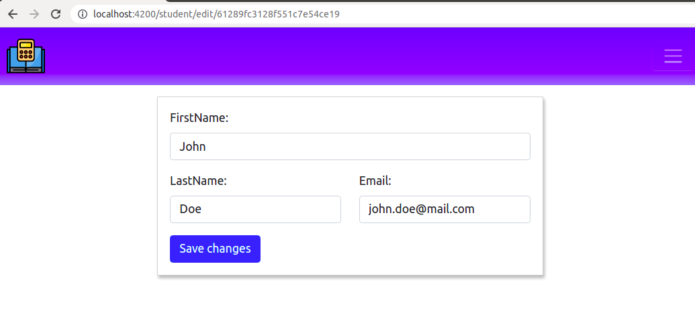
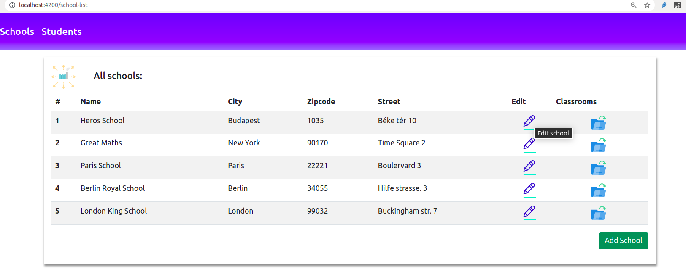
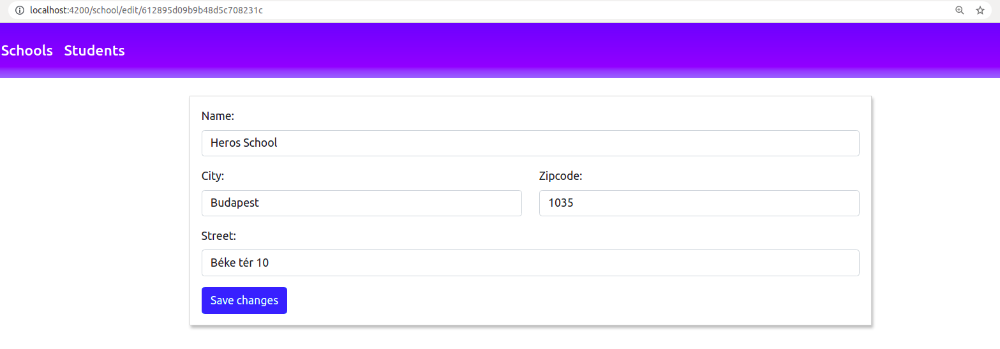
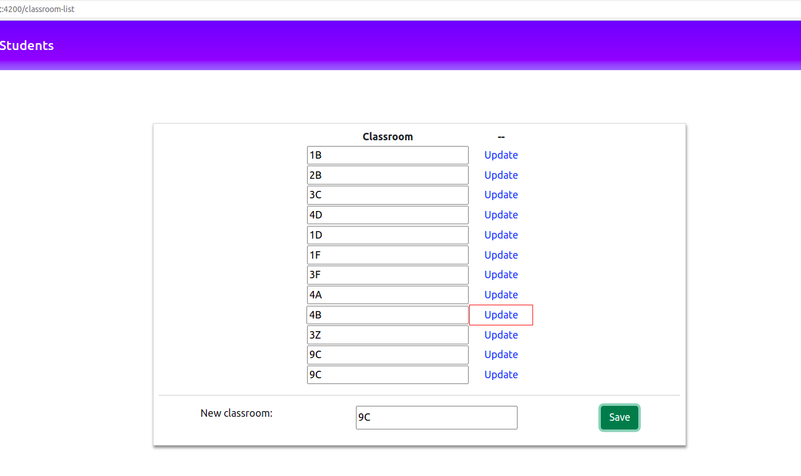
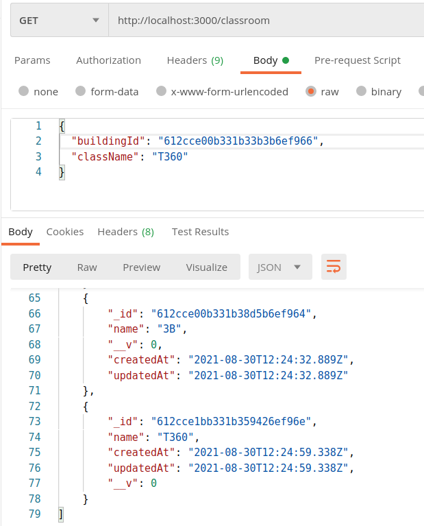
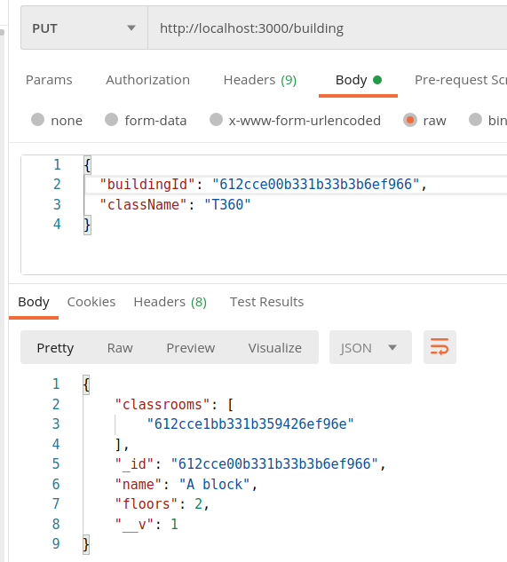
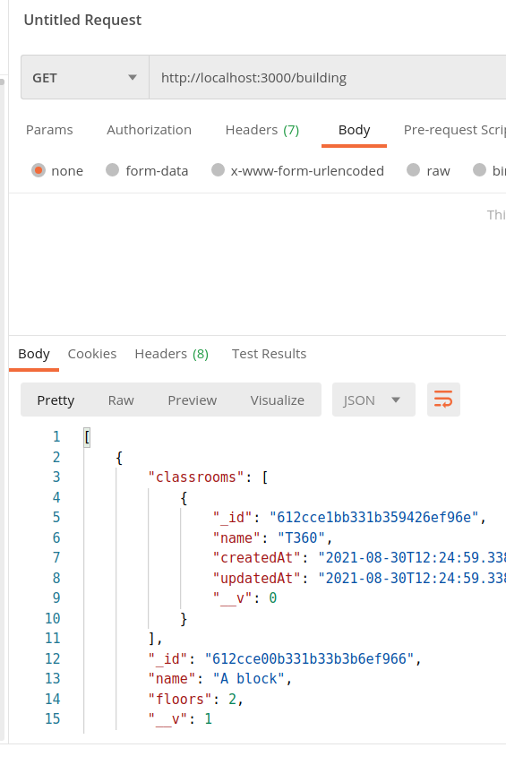
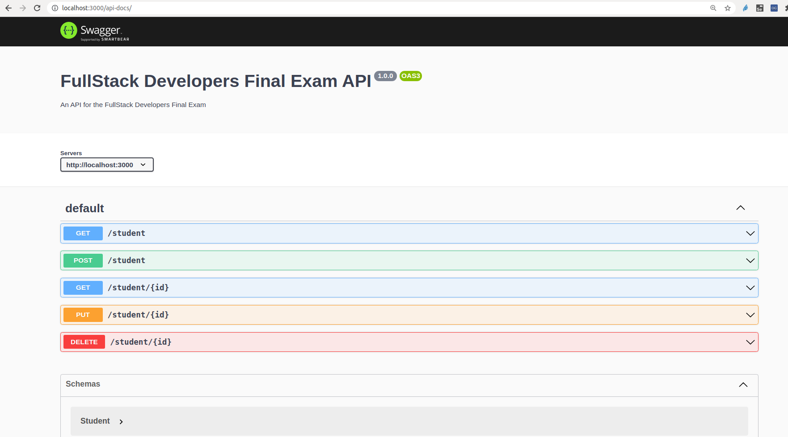

# Képesítő vizsga feladat 01.

Téma: **Elektronikus napló applikáció**

## Előkészítés:

### Backend
- Lépj be a terminal -on a `/backend` mappába és futtasd az `npm i` parancsot.
- Indítsd el a Dokcer Desktop alkalmazást.
- (opcionális) Lépj be a `/backend` mappába és állítsd be gyökér mappának: `code . -r`.
- Indítsd el az api -t a következő paranccsal: `npm run dev`.
- Ha bármikor úgy érzed, hogy nem frissül fejlesztés alatt az applikáció, állítsd le a dockert és inditsd újra a paranccsal
- összes backend teszt futtatása: `npm run test`. (szintén a dockerhez kapcsolódó adatbázist használ!),
de javasolt, hogy egyszerre inkább a feladathoz tartozó teszteket futtasd.

### Frontend
- A Bootsrap már be van konfigurálva az alkalmazásban
- Lépj be a terminal -on a `/angular` mappába és futtasd az `npm i` parancsot.
- Nyiss egy új VSCode -ot az adott mappában, itt fogod szerkeszteni a frontend -et:
`code .` (opcionális)
- Indítsd el a frontendet a következő paranccsal: `ng s -o` vagy `npm start`

### 1. feladat: Angular form készítés és navigáció (10 pont)

**Készíts egy template vagy reaktiv űrlapot, aminek a segítségével módisítani lehet egy már elmentett tanuló adatait. A szerver oldali rész készen van**

A "students" linkre kattintva megjelenik a tanulók listája. Az edit ikonra kattintva átírányit az oldal a student-form oldalra.

**Ide tartozó teszt futtató parancs:** `ng test --include='**/student-form/*.spec.ts'`

A `student-form` komponens file-jaiban kell dolgoznod.
FONTOS: válaszd ki, hogy melyik form típussal akarsz dolgozni. A form tulajdonságai/controllerek elnevezései kövessék az `input` mezők "id" elnevezéseit (lásd később).
Előre bírtunk két változót, amiből választhatsz. A másik változó maradjon benne érintetlenül:

- form: NgForm; => jelöld meg a HTML form elemedet '#form' referenciával
- reactForm: FormGroup; => reactive Form használata.

**Feladat előírásai:**

1.  A komponensnek azonosítani kell az url-ben meglévő id-alapján a tanulót és ki kell töltenie a beviteli mezőket a tanuló megfelelő adataival. (Használd fel a `student-http.service` megfelelő metódusát lekérdezni az adatokat)  => ActivatedRoute és a `snapshot params`, vagy feliratkozás segítségével
2. Jelöld meg a form elemet egy id="studentForm" tulajdonsággal. A kötelező form elemek:
- egy `INPUT` mező a "firstName" kezelésére (id-ja is ilyen nevet kapjon!). Típusa: "text", hozzátartozó `LABEL` elem, belső szöveges tartalma: "FirstName:"
- egy `INPUT` mező a "lastName" kezelésére (id-ja is ilyen nevet kapjon!). Típusa: "text", hozzátartozó `LABEL` elem, belső szöveges tartalma: "LastName:"
- egy `INPUT` mező a "email" kezelésére (id-ja is ilyen nevet kapjon!). Típusa: "email", hozzátartozó `LABEL` elem, belső szöveges tartalma: "Email:" **figyelj arra, hogy a label 'for' attributuma a megfelelő input mezőre mutasson!**
- egy `BUTTON` elem. Belső szövege tartalma: "Save changes". Id jelölő => "save-button"
- használd a megfelelő bootsrap class-t az említett INPUT, BUTTON ("primary" klassz szinnel) és LABEL elemek megjelölésére. Tovább CSS és stílus kikötés nincs a feladatban.
3. A beviteli mezőknek csak akkor lehetnek érvényesek, ha van bevitt tetszőleges adat bennünk. Csak az alap validáció elég. (Nem kell hibaüzenetet megjeleníteni)
4. A gomb csak akkor lehet kattintható ha minden mező érvényes.
5. Mentéskor meg kell hívódnia a "saveStudent" metódusnak. (paraméterként kapja meg a `ngForm` hivatkozást "template Form" használatakor, `FormGroup` használatakor nem kell paraméter)
6. A metódus használja fel a `student-http.service` update metódusát, hogy frissüljön az adat.
7. Sikeres http hívás után irányítson át az oldal a student-list komponensre. Meg kell jelennie benne a változtatásoknak. Segítségül egy kép a form megjelenésére:

### 2. feladat: Adatbázis (Mongoose séma) létrehozása. (10 pont)

**Ide tartozó tesztek forrása:**`controllers/school.test.js` és `school.integration.test.js`file.

Teszt futtató parancsok: `npm run test school.test.js` és `npm run test school.integration.test.js`

 A szerver oldalon kell dolgoznod, a kód egy része készen áll. A többi feladat:

- Pótold Mongoose modellt az `backend/src/models/school.model.js` fájlban.
- Frontenden a `models` mappában vannak a megfelelő model típusok
A mongoose Schema pontosan kövesse a frontend  megfelelő "school" modeljének a mintáját.
- _id értéke nem kötelező, figyelj arra, hogy mongoose modelben megfelelő típusosságot is adj tulajdonságoknak!
- A `backend/src/server.js` fájlban módosítsd a `/school` url -re érkező
kérések esetén a routert, hogy a service router szolgálja ki a kéréseket.

**Ellenőrzési lehetőség:**
- Ha nem indult újra a server, inditsd újra ekkor, ha kész a feladat. A `School` mongoose model ekkor már feltölti a server indításkor az adatbázist az iskolai entitásokkal is.
- A `Schools` linkre kattintva meg kell jelennie az iskoláknak.
- Az "edit ikon" rakattintva átírányít az oldal és megjelenik a `School-form` benne a  kitöltött iskolai adatokkal.

**Iskolai form megjelenése:**

### 3. feladat: Szerver oldali entitás kezelésének 3 rétegen keresztüli felépítése (10 pont)

**Ide tartozó tesztek forrása:** `controllers/classroom.test.js` és `classroom.integration.test.js`file

Teszt futtató parancsok: `npm run test classroom.test.js` és `npm run test classroom.integration.test.js`

- Pótold a backend -en a `backend/src/controllers/classroom` mappában hiányzó
service -t, routert, és controller -t.
- A validálásnak és a működési elvnek a többi controllerét kell követnie.
- A modellt készen kapod: `backend/src/models/classroom.model.js`.
- A `backend/src/server.js` fájlban módosítsd a `/classroom` url -re érkező
kérések esetén a routert, hogy a classroom router szolgálja ki a kéréseket.

Ellenőrzés: aktiváld az url-ben a kliens oldalon a Classroom-list komponenst a frontend oldalon (lásd routing.module és mellékelt kép). Ki kell listázódni az osztályoknak és módosíthatónak kell lenniük az `Update` gombra kattintva, vagy új osztály is elmenthető. (A lista frissül modósítás vagy mentés esetén)

**Ellenőrzési lehetőség:**

### 4. feladat: Összetett lekérdezés és entitás kezelés (10 pont)

Forrás mappa: `controllers/building`

**Ide tartozó tesztek forrása:** `controllers/building.test.js` és `building.integration.test.js`file

Teszt futtató parancsok: `npm run test building.test.js` és `npm run test building.integration.test.js`

1. adott egy `/building` nevű végpont a `server.js` file-ban, és egy "Building" model a `models` mappában.
2. a többi entitáshoz hasonlóan (3 réteg) tervezz meg és építs fel 2 végponton egy-egy összetett lekérdezést.
3. két metódust kell kezelnie a `building.routes.js` file-nak (put és get kérés). Kösd össze a `building.routes.js` file-t a `server.js` -ben lévő végponttal.
4. ha put kérés érkezik, akkor a `request body`-ból ki kell menteni egy "buildingId" és "className" tulajdonságot és továbbitani a megfelelő a service-nek.
5.  A `building.service.js` file-ban a "className" segítségével el kell mentenie egy új "classroom" entitást, és frissítenie kell a megfelelő épületet ("building" entitás) is egy művelet alatt. => elhelyezni az új "classroom" "id" értékét az épület entitás "classrooms" listájába.
(Az új "classroom"-nak meg kell jelennie szerver küldte listában, ha egy "get" kérés érkezne a `/classroom` végpontra. => lásd első kép)

6. A "building" entitás sikeres frissítése esetén a szerver küldje vissza a frissitett "building" entitást.
Meg kell jelennie az új classroom id-jának a "classrooms" nevű listájában (lásd második kép lejjebb)
7. Ha hiányos a "put" metódus body-ja, akkor küldjön egy "Badrequest" típusú http-error üzenetet 'Missing field' szöveggel
8. Ha "get" kérés érkezik a `/building` végpontra, akkor teljes "épület" listát küldje vissza, benne a populált classroom adatokkal. (lásd harmadik kép).
9. Használj Postman-t és az JEST teszteket ellenőrizni a megfelelő mükődést!
10. Pár vezető komment található az egyes file-okban.

**A mentett classroom ellenőrzése:**

**Put kérés visszaadja a frissitet épület objektumot, benne elmentetve az új Classroom id-já:**

**GET kérés a building végponton teljes populált listát ad vissza:**

### 5. feladat api-dokumentáció és végpont tervezés a Swagger segítségével: (10 pont)

- A `backend/src/doc/swagger.yaml` fájlban dolgozz.
- A dokumentumban pótold a `/school` végpontra küldhető kérések dokumentációját. (A többi kéréshez hasonlóan) => lásd segédkép a `Student` végpontot illetően
- Készítsd el a kapcsolódó Mongoose modell alapján a `School` sémát is, és arra
hivatkozz az egyes url -eknél!
- Minden metódus és url variáció szerepeljen, tehát az egy entitás lekérése, az
összes lekérése, a létrehozás, frissítés és a törlés is. Tehát 5 végpontot
kell definiálnod. De az elvárt szerver választ elég csak a SIKERES művelet esetén dokumentálni (pl: 200 statusz esetén
- Ahol request body-t kér, ott pontosan legyenek feltüntetve a kötelező mezők.
- Ahol szükséges paraméter (pld: id), ott pedig azt is meg lehessen adni.

Tesztelési lehetőségként, hívd meg az 'api-docs' végpontot a szerveren, hogy ellenőrizhető legyen az, hogy az összes "school" végpont megfelelően lett dokumentálva..

**Segéd kép**

